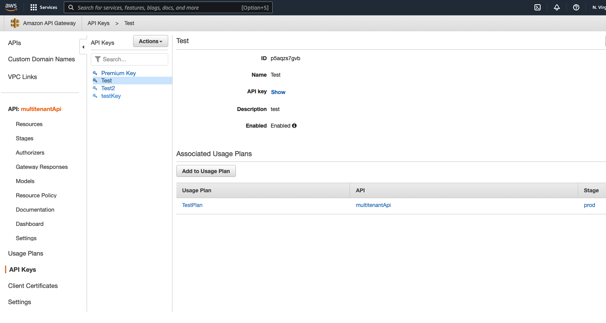

# Enable Pooling

## Summary

This page is intended to be after the sample application has been installed (see [INSTALL](./INSTALL.md)), and the user has gotten familiar with the basic functionality (see [WALKTHROUGH](./WALKTHROUGH.md)).  The advanced concept presented here is dealing with the total number of available API Keys as a limited resource, so for large number of users, some kind of pooling mechism becomes necessary.  See the associated [blog](https://aws.amazon.com/blogs/startups/) for more details.

## Activate Pools of API Keys for Certain Usage Plans Tiers

Although the sample code has the capacity to pool API Keys for certain usage plans, it does not do so without code modification.  Follow these steps to enable that functionality.
 
First, delete all your API Keys except for one API Key in the Free Tier, and five API Keys in the Basic Tier.  The next step will turn those six keys into pools.

Second, go to `${TOP}/lambdas/api_key_pools.js` and edit the file as described in the comments.   
 You will need to use the AWS Console to inspect Usage Plans in the API Gateway to get the correct ID numbers.

Here's a screenshot of the API Gateway from the AWS Console.  The ID for the Usage Plan called "BasicPlan" is `vexgx5` in this image, but it will be different for everyone. 


This is a screenshot for the API Keys.  The Id for the API Key in this screenshot is `p5aqzs...`, but it will be different for each deployment. That's the value you want to enter in the  `${TOP}/lambdas/api_key_pools.js` file as well.



Lastly, re-deploy the lambda functions using CDK.  (CDK is intelligent enough to detect changes and deploy just the updates.)
```
cd ${TOP}/cdk
cdk deploy
```

## What this change does

When the data structure in `${TOP}/lambdas/api_key_pools.js` is empty (as it was in the initial deployment), the business logic in the `createKey` and `deleteKey` Lambda functions behave in "siloed" mode, where each request pertains to a unique key. When the data structure is populated, the Lambda functions understand that certain API Keys are pooled resources in specific Usage Plans and will share them across users.  In a production system, this could be encoded into a database query or parameter store. 

## How to verify pooling

Again, read the blog post for more details, for starters, delete all the keys through the web application.  Now go back to the API Gateway in the AWS Console, you will find six keys persist: 1 on the FreePlan and 5 in the Basic Plan.  

Now create 10 Keys of each type in the sample application.  Going back to the API Gateway in the AWS Console, you should see 10 API Keys on the Test Plan,  10 API Keys on the Premium Plan, the same 5 keys in the Basic plan as before, and the 1 single Key in the Free Pool. 

Next test, create five Keys in the FreePlan.   Test each one of these in the Dashboard's testing panel and note the actual UUID in the X-Api-Key header. It should be the same UUID for all five keys.

## Why it behaves this way
When requests to create or delete a key hit the lambda functions, they are testing first to see if the Usage Plan is in a fixed pool or not.   If it is in a pool, then the entry in DynamoDB is essentially a reference to a shared resource.  If the Usage Plan does not have a pool of keys, then the Lambda Function creates/destroys an API Key with API Gateway service directly, then records the metadata in DynamoDB.

## Next

Even though the cost of this sample code is very small, it is still important to clean up when you're done.  Look for cleanup instructions in the [README](./README.md)


