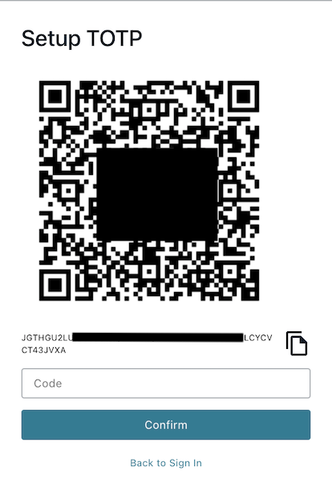

# INSTALL

## 1. Prerequisites

1. AWS Account
2. [AWS CLI](https://aws.amazon.com/cli/) configured and installed (or [AWS Cloud9](https://aws.amazon.com/cloud9/))
3. [AWS CDK](https://docs.aws.amazon.com/cdk/v2/guide/getting_started.html) installed (version 2.12.0 or later)
3. Node.js installed

## 2. The CDK

Most of the backend infrastructure is built using the AWS CDK in TypeScript.  If you don't already have TypeScript 3.8 or later, install it using `npm`.  Before running the CDK, there are a few key pieces of information that need to be copied over from Amplify's build.  Primarily the Cognito deployment because it needs to be used as an authorizer for parts of Amazon API Gateway.

### 2.1 Deploy Backend with CDK
```bash
npm install -g typescript

cd cdk/

npm install

cdk bootstrap # may be able to skip this if you've used CDK before and infrastructure (e.g. CDK staging bucket) is already initialized 

cdk deploy --all
cdk destroy --all
```
## 3. Set up AWS Amplify and local frontend

As the AWS Amplify Construct for CDK is in preview, we will use the Amplify CLI instead. Note, if you are using SSO instead of IAM Users to access your account, you will want to run `aws configure sso` from the command line first.

### 3.1. Install and Configure Amplify CLI

This creates an Amplify Administrator IAM User.  Note that the command line argument will launch the AWS Console

```bash
npm install -g @aws-amplify/cli

amplify configure
  # choose same region as the rest of this workshop
  # choose user name
  # finish creating IAM user in AWS console
  # copy AccessKey and SecretAccessKey from console back into the prompt
  # chose a profile name that the AmplifyCLI will use for this new IAM user
```

### 3.2. Use Amplify CLI to configure resources for the web application

Basic initialization 
```bash
cd $react/ 

amplify init
  # enter name for the project
  # accept the default configuration
  # choose "Profile" as the authorization method, if local -- or choose AWS Access Keys (Cloud9)
  # choose the profile name created in "amplify configure"
```

Import Cognito User Pool created by CDK as authentication provider for this project
```bash
amplify import auth
  # Choose "Cognito User Pool only"
  # Choose User Pool created by CDK with name starting with UserPool (e.g. UserPool6BA7E5F2-VQFB73BtHTuf)

amplify push
  # yes
```

The deployment may take a few minutes. 

### 3.3. Testing the frontend with local backend

Let's start with installing packages for the react application
```bash
npm install
```

The react application comes with a development server that can be run locally. Review `$react/src/config.json` for configuration of the local environment
```json
{
  "USE_LOCAL_API": true,
  "LOCAL_API_BASE": "http://localhost:5100",
  "REST_API_BASE": ""
}
```
We'll return to setting `REST_API_BASE` later, after the backend is installed via CDK.

Now in one terminal, start the local API backend. `dev-backend` script is defined in `$react/package.json` and uses port `5100` to run a local json-server to act as local API for testing. 
```bash
npm run dev-backend
```

In a second terminal, start the react server for frontend. We are using the default port `3000`
```bash
npm start
```

Directing your browser to `http://localhost:3000`, the following login screen should appear. 


Your Amazon Cognito User Pool created earlier by Amplify will be empty and you will need to sign up a user to access the frontend.


Click on Create Account tab and sign up using your email address and set password (minimum 8 characters). You will receive an email with one time code to verify email address to complete sign-up as user in your Amazon Cognito User Pool.

At your first login, you will be prompted to set up MFA. Scan QR code with authenticator app to complete setup.



After creating a login with Cognito, the application will show the sample data from local API server. You can also review sample data in `$react/db.json`.


### 3.4 Update the React App to use Amazon API Gateway endpoint

After the `cdk deploy` command completes from the previous step, you should see in the last few lines of output mention of a multitenantApiEndpoint.  It will be in the form of `https://${id}.execute-api.${AWS)_REGION}/amazonaws.com/prod`.  Copy the value and set it to the `REST_API_BASE` in `$react/src/config.json`.  Also update `USE_LOCAL_API` value to `false`.

This will update the react application to use the Amazon API Gateway instead of the local development server.

### 3.5 Run the React App

```bash
cd $react
npm start
```

### 3.6 Open the App in a Browser and Login


Navigate to `http://localhost:3000` in your browser to access updated React frontend. You can login use an account you created earlier step.

Continue to the [WALKTHROUGH](./WALKTHROUGH.md)


