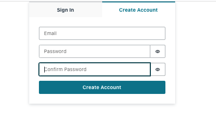
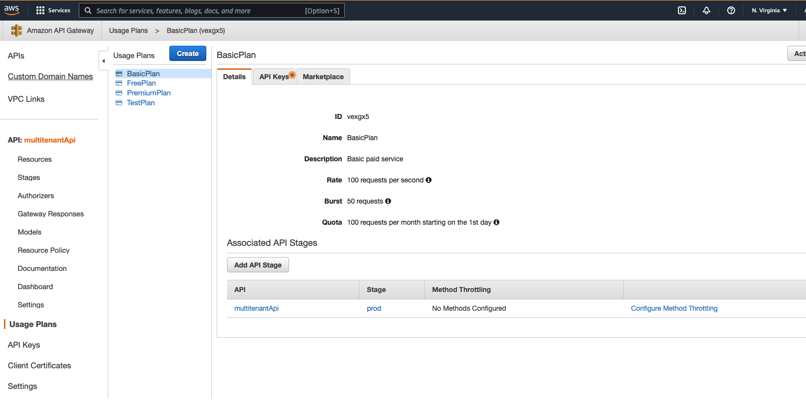
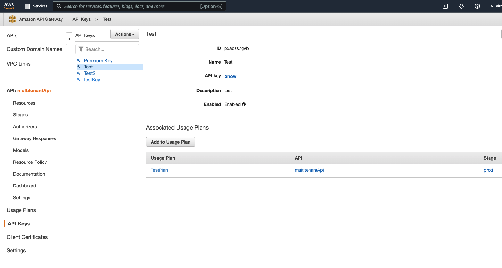

# INSTALL

## 1. Prerequisites

1. AWS Account
2. AWS CLI configured and stalled (or Cloud9)
3. AWS CDK installed (version 2.12.0 or better)
3. Node.js installed

## 2. AWS Amplify

As the AWS Amplify Construct for CDK is in preview, we will use the Amplify CLI instead. Note, if you are using SSO instead of IAM Users to access your account, you will want to run `aws configure sso` from the commandline first.

### 2.a. Install and Configure Amplify CLI

This creates an AmplifyAdministrator IAM User.  Note that the commandline argument will launch the AWS Console

```bash
npm install -g @aws-amplify/cli

amplify configure
  # choose same region as the rest of this workshop
  # choose user name
  # finish creating IAM user in AWS console
  # copy AccessKey and SecretAccessKey from console back into the prompt
  # chose a profile name that the AmplifyCLI will use for this new IAM user
```

### 2.b. Use Amplify CLI to configure resources fo the web application

Basic initialization 
```bash
# assumption:  TOP = TOP directory of this package
cd ${TOP}/react/ 

amplify init
  # enter name for the project
  # accept the default configuration
  # choose "Profile" as the authorization method, if local -- or choose AWS Access Keys (Cloud9)
  # choose the profile name created in "amplify configure"
```

Add Cognito as authentication provider for this project
```bash
amplify add auth
  # Choose "Default configuration"
  # Choose "Email"
  # No additional customization

amplify push
  # yes
```

The deployment may take a few minutes. 

### 2.c. Testing the frontend.

The react application comes with a development server that can be run locally. Create a file, `${TOP}/react/src/config.json`, with the following contents 
```json
{
  "USE_LOCAL_API": true,
  "LOCAL_API_BASE": "http://localhost:5000",
  "REST_API_BASE": ""
}
```
We'll return to setting `REST_API_BASE` later, after the backend is installed via CDK.


Now in one terminal, start the backend
```bash
npm run dev-backend
```

In a second, start the react server
```bash
npm start
```

Directing your browser to `http://localhost:3000`, the following login screen should appear. 


After creating a login with Cognito, the application should show reasonable data. 


## 3. The CDK

Most of the backend infrastructure is built using the AWS CDK in TypeScript.  If you don't already have TypeScript 3.8 or later, install it using `npm`.  Before running the CDK, there are a few key pieces of information that need to be copied over from Amplify's build.  Primarily the Cognito deployment because it needs to be used as an authorizer for parts of API Gateway.

### 3.1 Find the Cognito User Pool ARN

Look in `${TOP}/react/src/aws-export.js` for the value of the `aws_user_pools_id`.  Assign the same value to `cognitoUserPoolId` in `${TOP}/cdk/bin/cdk.ts`.

### 3.2 Deploy CDK

```bash
npm install -g typescript
cd ${TOP}/cdk/
npm install
cdk bootstrap # initialize cdk infrastructure, staging bucket, etc.
cdk deploy
```
### 3.3 Update the React App

After the `cdk deploy` command completes from the previous step, you should see in the last few lines of output mention of a multitenantApiEndpoint.  It will be in the form of `https://${id}.execute-api.${AWS)_REGION}/amazonaws.com/prod`.  Take that value and set that to the `REST_API_BASE` in `${TOP}/react/src/config.json`.  Also set `USE_LOCAL_API` to `false`.

This will cause the react application to contact the API Gateway instead of the local development server.

### 3.4 Run the React App

```bash
cd ${TOP}/react
npm install
npm start
```

### 3.5 Open the App in a Browser, Create an account



### 3.6 Activate Pools of API Keys for Certain Usage Plans Tiers

Although the sample code has the capacity to pool API Keys for certain usage plans, it does not do so yet.  Follow these steps to enable that functionality.
 
First, create one API Key in the Free Tier, and Five API Keys in the Basic Tier.

Second, go to `${TOP}/lambdas/api_key_pools.js` and edit the file as described in the comments.   
 You will need to use the AWS Console to inspect Usage Plans in the API Gateway to get the correct ID numbers.






Lastly, re-deploy the lambda functions using CDK.  (CDK is intelligent enough to detect changes and deploy just the updates.)
```
cd ${TOP}/cdk
cdk deploy
```

__Why this works__
When the data structure in `${TOP}/lambdas/api_key_pools.js` is empty (as it was in the initial deployment), the business logic in the `createKey` and `deleteKey` Lambda functions behave in "siloed" mode, where each request pertains to a unique key. When the data structure is populated, the Lambda functions understand that certain API Keys are pooled resources in specific Usage Plans and will share them across users.  In a production system, this could be encoded into a database query or parameter store. 


