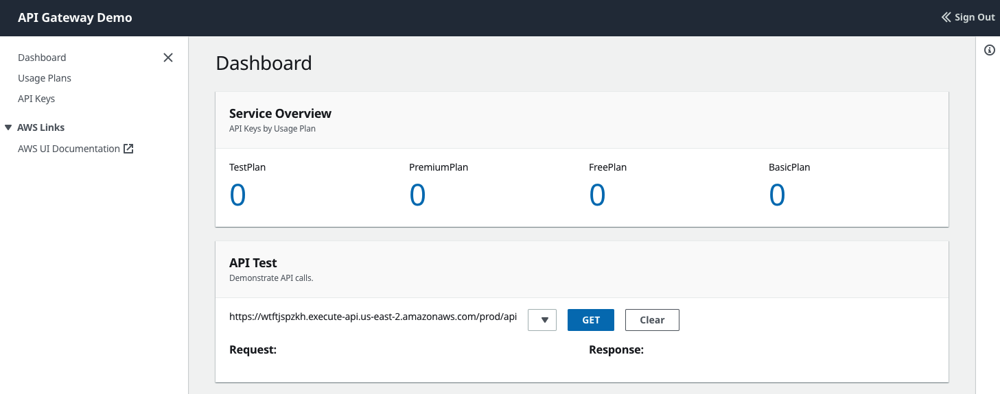
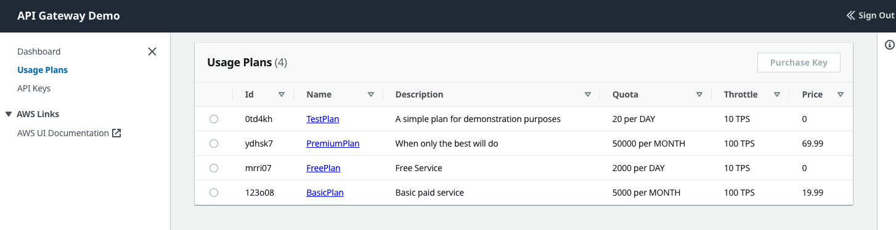
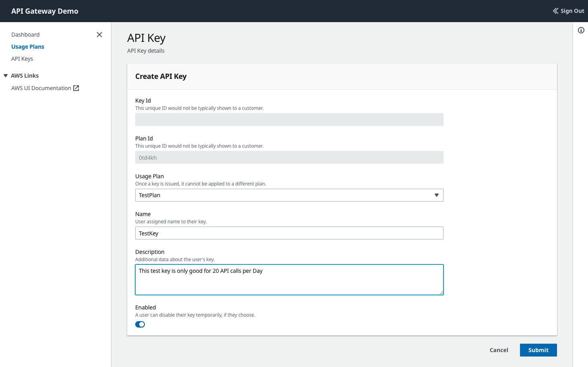
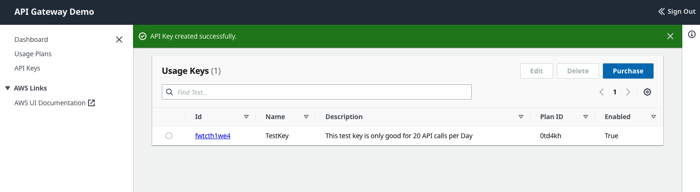
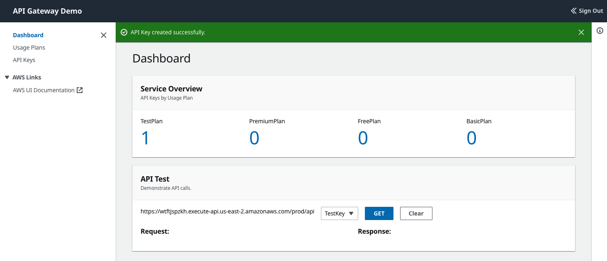
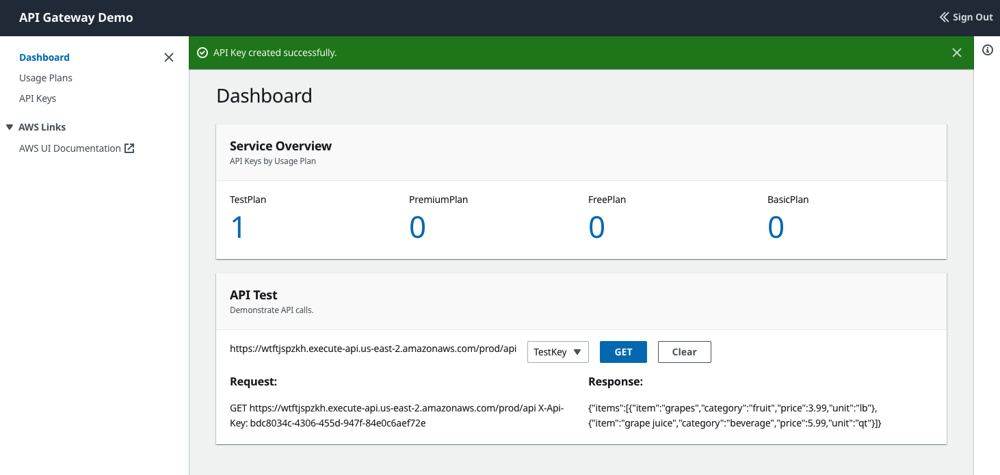
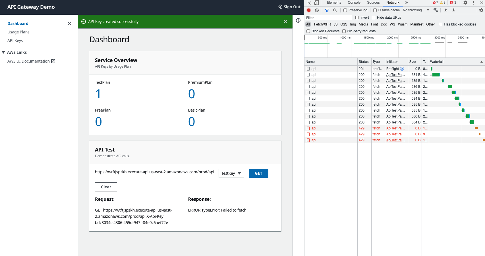
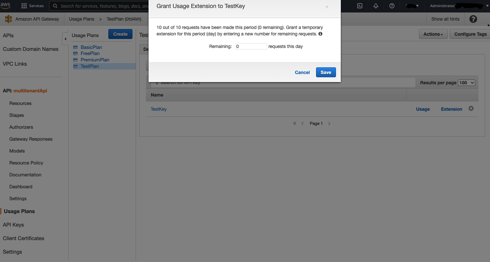

# Walkthrough

## About this page: 
This document assumes that you've already successfully built the sample code (see [INSTALL.md](INSTALL.md)).  This walks through the basic functionality of the sample application.  It is a very simple UI to vend API Keys and test them. At the end of this page, you should have a good idea how API Keys work, and been able to demonstrate how API Gateway can switch from HTTP 200 responses when things are allowed, to HTTP 429 responses when API Gateway is throttling traffic. 

## Getting Acquainted with the UI

After logging in the first time, the application looks like this, with four Usage Plans and no API Keys.



Choosing `Usage Plans` on the side panel, we can get more detail about the Usage Plans. In this example, they have different quotas and throttle characteristics. 



Create a Key from the `Test Plan` as shown below. This particular plan is useful for demonstration purposes because the quota is very low: 20 calls per day.



After the key is successfully created, the application lands on the listing of all API Keys available to this user.




Going back to the Dashboard, we see that we now have one key.  More importantly, there is a testing utility in the second box of the Dashboard.



## Demonstrating the Quota Limit

Select the key from the dropdown and press the `GET` button to issue an HTTP GET command.  The request, with the X-API-KEY Header shows in the left, the response appears in the right, a sample JSON body.



Open up the developer tools within the browser and press the GET button several more times. Eventually the 200 HTTP response will change to a 429 response when the quota is expired.



## Granting Exceptions

An exception for this quota can be granted via the AWS Console



## Other Experiments

1. Log out, create a second login with a different email, and create a new API Key with the same UsagePlan.  You should be able to use that one until API Gateway throttles that independently.

2. You can also try exercising the API on the command line using cURL 
```bash
curl -H "X-Api-key: <UUID> " https://<API_GATEWAY>.execute-api.<AWS_REGION>.amazonaws.com/prod/api 
```
Where `<UUID>`, `<API_GATEWAY>` and `<AWS_REGION>` can be discovered in the API Test panel of the Dashboard.

3. For the really curious, try loadtesting one of the other usage plans.  API Gateway will throttle based on best-effort, so don't be suprised if a few extra requests get through on some experiements.
## Next
Continue to the [ENABLE_POOLING](./ENABLE_POOLING.md)